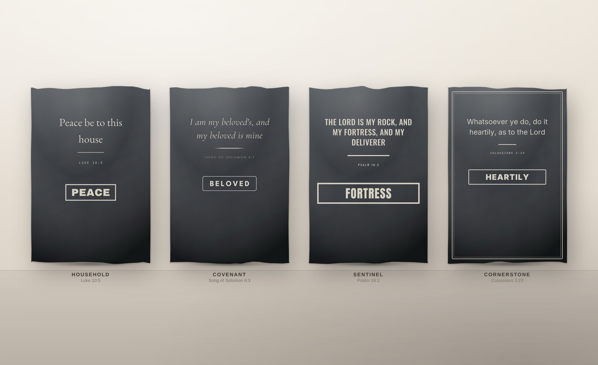
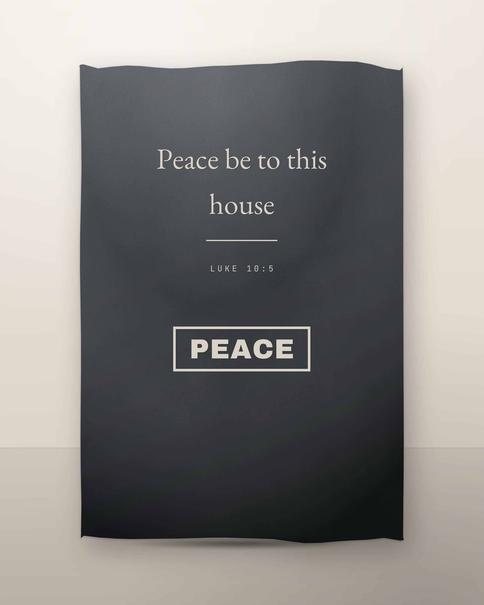
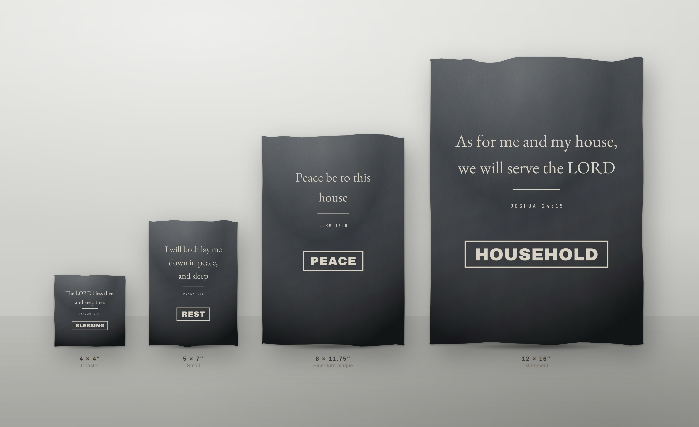

# Slate Plaque Studio

A browser app for designing scripture slate plaques and exporting laser-ready
SVG for xTool. Built around one layout: a short verse, a rule, the
chapter-and-verse line, and one subject word in a box.



Every element — wording, typeface, weight, size, letter-spacing, case,
alignment, spacing, and the thickness of every box and rule — is adjustable,
and the file that reaches the laser is the same geometry you approved on
screen.

---

## Running it

**Double-click the launcher for your machine:**

| | |
|---|---|
| macOS | `Launch Slate Studio.command` |
| Windows | `Launch Slate Studio.bat` |
| Linux | `launch.sh` |

It starts the studio and opens your browser. Closing the window stops it. If
the studio is already running it reuses that one rather than starting a second
copy, and if the port is busy it moves to the next free one.

The only requirement is [Node.js](https://nodejs.org) 18 or newer — the
launchers check for it, look in the usual install locations when it is not on
`PATH` (Homebrew, nvm, fnm, Volta, the Windows installer), and say plainly what
to install if it is genuinely missing.

> **macOS, first run.** Files downloaded from the internet are quarantined, so
> Gatekeeper may refuse to run the `.command`. Right-click it → **Open** →
> **Open**, once. If Finder opens it in a text editor instead of running it,
> the executable bit was lost in transit: `chmod +x "Launch Slate Studio.command"`.

From a terminal, equivalently:

```bash
npm start                     # launch + open a browser
node tools/serve.mjs          # just the server, no browser
```

No build step and no install: plain ES modules, every font bundled. It does
need to be *served* rather than opened as a `file://` page — ES modules and the
font loading are both blocked by the file:// origin rules, which is the whole
reason there is a launcher.

Optional, for the tooling only:

```bash
npm install                   # playwright, for the smoke test and renders
npm test                      # 16 checks against a headless browser
```

---

## What makes the export laser-safe

This is the part that matters, so it is worth being specific. The exported SVG:

| Property | Why |
|---|---|
| `width`/`height` in **mm**, `viewBox` matching 1:1 | Imports at true physical size instead of at whatever an importer guesses |
| Every glyph is an **outline**, never `<text>` | The machine does not need your fonts installed, and cannot substitute one |
| **No `<style>`, no CSS classes** | xTool Creative Space parses presentation attributes far more reliably |
| **No `transform` attributes** | Coordinates are baked absolute, so nothing is re-interpreted on import |
| Boxes are **filled rings**, not strokes | A 1.6 mm border measures 1.6 mm; a stroke is a hint an importer may rescale |
| Fills and strokes kept in separate groups | Engrave and cut stay distinguishable |

The smoke test asserts each of these on a real export, and asserts that the
exported path data is byte-identical to the geometry the preview drew.

### xTool workflow

1. **Export SVG** in the app.
2. In xTool Creative Space: `File → Import` and pick the SVG.
3. Confirm the size reads as your board (203.2 × 298.45 mm for the 8 × 11.75″
   plaque). If it does not, the importer's DPI assumption is wrong — re-import
   rather than rescaling by hand, so the border thickness stays true.
4. Set the `engrave` group to **Fill / Raster engrave**.
5. If you included the board outline, set that group to **Ignore** (it is only
   an alignment reference) or to Score if you actually want it marked.

Slate wants low power and high speed — it is marking the surface, not cutting
it. Run a test grid on an offcut for your machine and stock; the app's job ends
at handing you correct geometry.

**Minimum feature sizes.** Below roughly 0.4 mm, rules and box walls start to
disappear into the stone's grain. The app will happily draw a 0.2 mm rule; the
slate will not necessarily show it. The **Flat view** button strips the stone
away and shows exactly what the laser sees, which is the honest place to check
a hairline before committing a board.

---

## The editor



**Left** — the verse library: 232 verses, searchable by text, reference,
subject word or tag, filterable by collection.

**Middle** — the plaque. `Guides` shows margins, centre line and the content
extents. `Flat view` swaps the stone for a plain black-on-white rendering of
the engrave geometry.

**Right** — the controls, grouped by element:

- **Verse** — typeface, weight, italic, size, letter-spacing, line height, text
  width, alignment, case, gap below, and a *Fit to board* button that shrinks
  the verse until it fits in three lines or fewer.
- **Divider** — none, single, double, tapered, diamond or cross; width and
  thickness in mm.
- **Reference line** — its own typeface, size, tracking and case.
- **Subject word** — typeface, size, tracking, plus the box: thickness, corner
  radius, horizontal and vertical padding, and whether it hugs the word, holds
  a fixed width, or spans the full content width. Alternative subject words for
  the current verse appear as one-click chips.
- **Eyebrow / Footer** — optional lines for names, dates, "Established 2019".
- **Border frame** — single or double rule inset from the board edge.
- **Board & layout** — blank size, custom dimensions, margins, and whether the
  stack is pinned to the top, centred, pinned to the bottom, or set at a fixed
  distance from the top.

Leave a text field blank and it follows the selected verse; type in it and your
wording wins. **Reset** puts it back on the verse.

The app warns when content runs past a margin, when the subject word is wider
than its box, when a verse will not fit the text width, and when a bottom-
anchored footer has drifted under the stack.

### Batch export

`Batch…` renders one SVG per verse — a collection, the current filter, or the
whole library — and packages them as a single `.zip`. Filenames carry the
reference, subject word and board size (`Luke-10-5_PEACE_203x298mm.svg`), so a
production run can be matched back to an order without opening anything.
*Auto-fit* rescales each verse to its board, which matters because a batch
spans verses of very different lengths.

Designs save to browser storage, and export/import as JSON.

---

## The verse library

232 verses, each carrying a plaque excerpt, the full verse, a default subject
word, alternative subject words, and search tags.

**Every excerpt is verified, not remembered.** `tools/build-verses.mjs` checks
each one against the actual biblical text and fails the build if an excerpt is
not a verbatim, contiguous span of its verse. Three errors were caught this way
on the first run. The modern-English variant is derived by aligning the two
translations word by word, and a guard rejects any derived span that looks
truncated or overrun — the 22 that tripped it are pinned by hand in
`tools/verses.source.mjs` and checked against the real WEB text the same way.

Both translations are **King James Version (1769)** and the **World English
Bible** — public domain worldwide, which is what makes them safe to sell
engraved on a product. See [docs/LICENSING.md](docs/LICENSING.md) before
substituting a modern translation; most of them are licensed, and NIV/ESV/NLT
in particular are not free to put on merchandise.

To rebuild the library after editing `tools/verses.source.mjs`:

```bash
npm pack es-kjv && npm pack world-english-bible   # dev-only corpora, ~20 MB
# extract into tools/.corpora/{kjv,web}
node tools/build-verses.mjs
```

---

## Collections

Eight house styles, each a saleable line with its own typographic voice and its
own slice of the verse library. Applying one changes the styling and leaves your
board, margins and personalisation alone.

| Collection | For | Voice |
|---|---|---|
| **Household** | Housewarming, entryways | Garamond, hairline rule, heavy boxed word |
| **Covenant** | Weddings, anniversaries | Italic Cormorant, tapered rule, fine radiused box |
| **Sentinel** | Strength, service, hard seasons | Condensed caps, 2.4 mm border, full-width box |
| **Grace** | Sympathy, memorial, comfort | Light Cormorant, diamond divider, no box |
| **Cornerstone** | Offices, workshops, corporate gifts | Grotesque throughout, framed border |
| **Table** | Kitchens, dining rooms | Playfair, cross divider, Bebas word |
| **Nursery** | Births, baptisms, dedications | Infant serif, rounded box, name line on by default |
| **Pilgrim** | Trust, guidance, the long walk | Roman inscriptional capitals |

Sizes run from a 4 × 4″ coaster to a 12 × 16″ statement piece.
[docs/PRODUCT-LINE.md](docs/PRODUCT-LINE.md) covers the range, SKU scheme and
listing copy.



---

## Repository

```
Launch Slate Studio.command   double-click launcher (macOS)
Launch Slate Studio.bat       double-click launcher (Windows)
launch.sh                     launcher (Linux, and the shared implementation)
index.html               the editor
assets/js/
  fonts.js               font book: parsing, metrics, text→outline
  shapes.js              rules, rings, frames
  model.js               the design document and its defaults
  render.js              layout engine + SVG output (preview, flat, export)
  presets.js             the eight collections
  verses.js              GENERATED — 232 verified verses
  app.js                 editor UI
  zip.js                 store-only zip writer for batch export
assets/fonts/            27 families, 81 static TTFs, Latin-subset (3.9 MB)
vendor/opentype.min.js   font parsing
tools/
  launch.mjs             port selection, browser opening, shutdown
  serve.mjs              static server
  smoke.mjs              16 checks in a headless browser
  build-verses.mjs       verifies verses against KJV/WEB, emits verses.js
  verses.source.mjs      the editorial source list
  fetch-fonts.mjs        downloads the font set
  subset-fonts.sh        trims it 13 MB → 3.9 MB
  marketing.html         scene template for renders
  render-marketing.mjs   produces marketing/
marketing/               eight renders, regenerable
docs/                    licensing, product line
```

### Known limitation

opentype.js does not apply class-based GPOS kerning, so a few pairs in some
serif faces sit at their unkerned width. Preview and export share the code path,
so what you see is exactly what you get, and the per-element letter-spacing
control compensates where it matters. Fonts are Latin-subset: accented
characters for names are included, other scripts are not.

---

## Licensing summary

Fonts are OFL 1.1 or Apache 2.0, verse text is public domain, opentype.js is
MIT. Nothing here restricts selling what you make. Full detail and the
per-family list is in [docs/LICENSING.md](docs/LICENSING.md).
